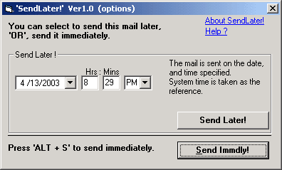



## Addin for Outlook in VB \(SendLater\)

### Description

Send Later V1.0 is an 'Addin' for Microsoft Outlook to enable users of outlook to send mails at differed delivery times.

By default outlook sends the mail as soon as the 'send' button is clicked in a mail window.

----

Source code is attatched.

----

Creating the addin - is explained in a codeReadme.txt in the download(.zip file)

----

To just use the application on your outlook.., register the dll provided with the code(.zip file) on your machine.. and open outlook .... >> options >> other >> advanced >> comaddins >> add new 'addin', point to the dll.

----

Then open a new mail window and try sending a mail, to see the dll in action.

----

 
### More Info
 

             |
---                |---
**Submitted On**   |2003-04-13 21:12:18
**By**             |[copaoflife](https://github.com/Planet-Source-Code/PSCIndex/blob/master/ByAuthor/copaoflife.md)
**Level**          |Intermediate
**User Rating**    |4.6 (23 globes from 5 users)
**Compatibility**  |VB 6\.0
**Category**       |[Complete Applications](https://github.com/Planet-Source-Code/PSCIndex/blob/master/ByCategory/complete-applications__1-27.md)
**World**          |[Visual Basic](https://github.com/Planet-Source-Code/PSCIndex/blob/master/ByWorld/visual-basic.md)
**Archive File**   |[SendLater\!1573444142003\.zip](https://github.com/Planet-Source-Code/copaoflife-addin-for-outlook-in-vb-sendlater__1-44715/archive/master.zip)

